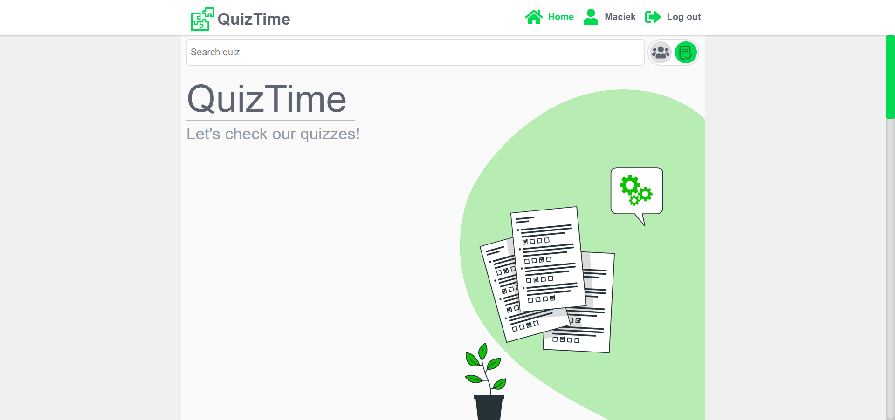
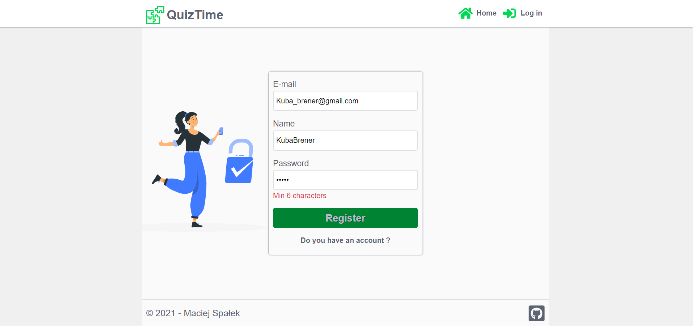
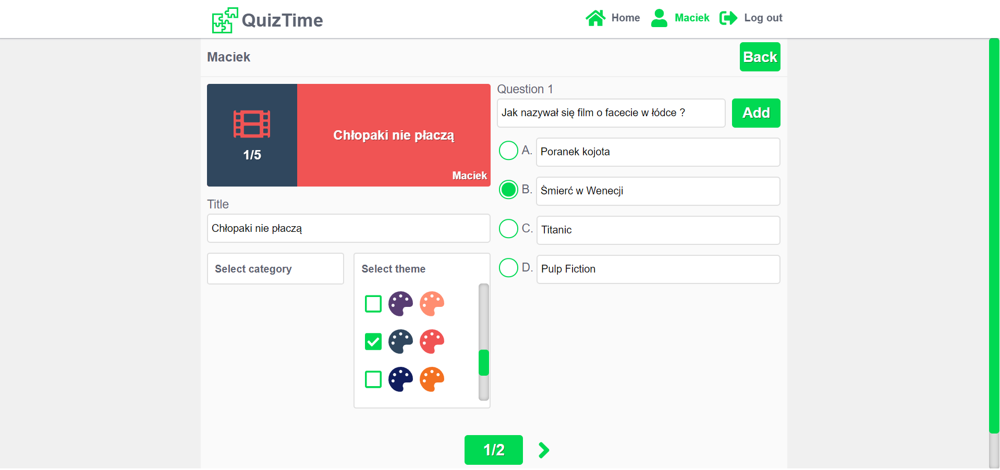

# QuizTime - register and create your first quiz!

## About application

QuizTime is an application developed in React + TypeScript, used to creating and taking quizzes.
You can take quiz, but if you want to create your own quiz, it's necessary to register. It's first version of this application and it's still in improvement process.

## Screenshots







&nbsp;

## FRONTEND

### Tech/framework used

| Tech              | Description                                                                 |
| ----------------- | --------------------------------------------------------------------------- |
| React             | The library for building user interfaces                                    |
| TypeScript        | A language for application-scale JavaScript.                                |
| React hooks       | New addition in React 16.8. allowing to use the state without using classes |
| React router      | Declarative routing for React                                               |
| Redux             | The library for state management applications                               |
| Styled Components | A React package to manage styles in applications                            |
| Axios             | It's a Javascript library used to make HTTP requests from node.js           |
| Formik            | Library to build forms without tears                                        |
| Yup               | Library to validation                                                       |

&nbsp;

### Installation app

```
git clone https://github.com/MaciejSpalek/QuizTime-frontend.git

npm install

npm start
```

&nbsp;

## BACKEND

### Tech/framework used 

| Tech         | Description                                                                                              |
| - | - |
| node.js      | A JavaScript runtime built on Chrome's V8 JavaScript engine.                                             |
| express.js   | Node.js web application framework                                                                        |
| jsonwebtoken | Library to manage JWT                                                                                    |
| bcrypt.js    | A library to help hashing passwords.                                                                     |
| dotenv       | A zero-dependency module, that loads environment variables from a .env                                   |
| mongoose     | A MongoDB object modeling tool designed to work in an asynchronous environment.                          |
| cors         | Package for providing a Connect/Express middleware that can be used to enable CORS with various options. |
| Formik       | Library to build forms without tears                                                                     |
| Joi          | The most powerful schema description language and data validator for JavaScript.                         |

&nbsp;

### Installation server

```
git clone https://github.com/MaciejSpalek/QuizTime-backend.git

npm install

nodemon
```

## Live

https://quizz-time.netlify.app/

